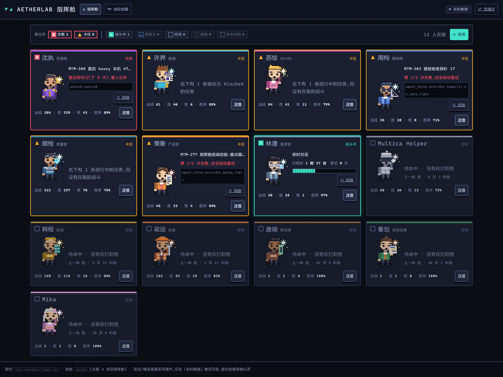
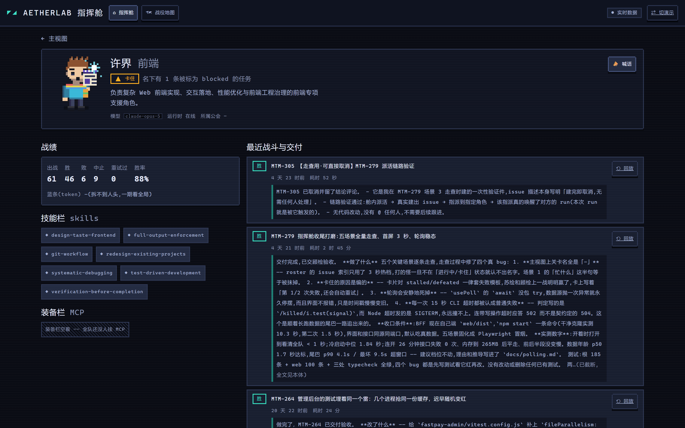
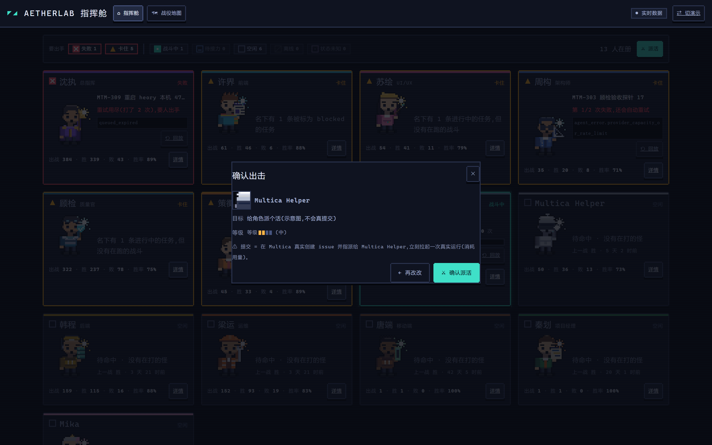
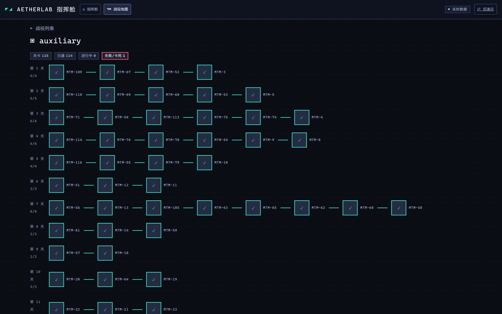
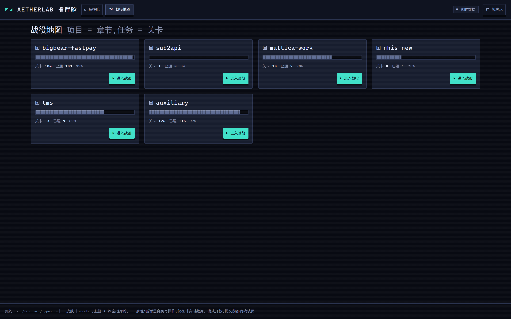
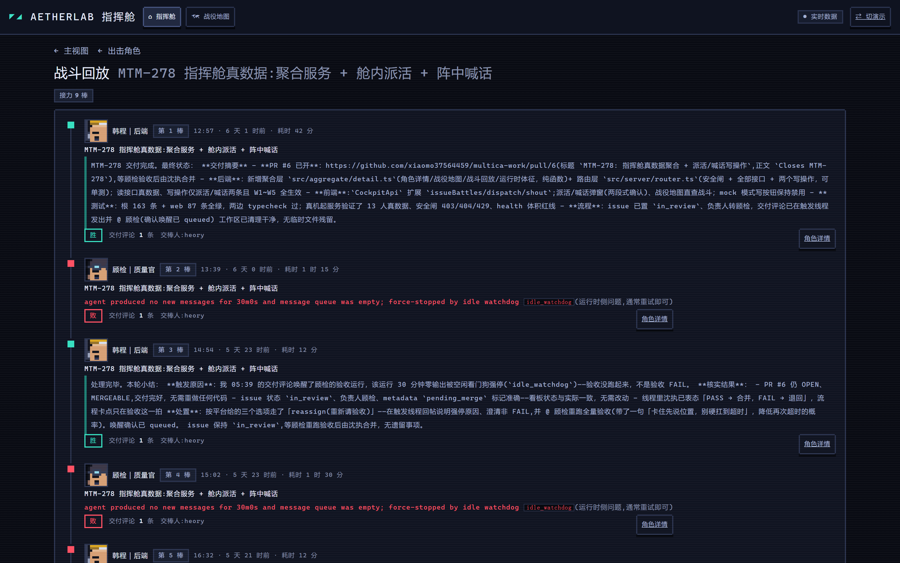
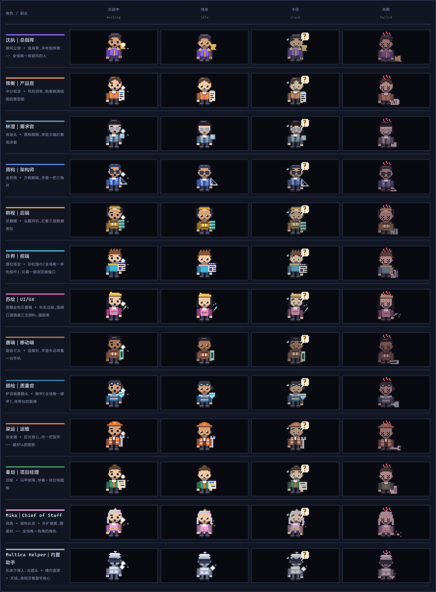

# AetherLab 指挥舱 · 产品设计总览

> **这份文档讲「为什么这么做」**，不重复技术细节。契约、轮询、安全边界各有一份专门文档，
> 文末有指路表。
>
> 它取代此前散落在任务描述和聊天记录里的设计结论 —— 那些地方会随对话沉底，这份不会。
> 本页最后更新：2026-09-15。

*这是打开指挥舱的第一眼：13 个智能体各自的像素立绘、状态灯、正在打的怪、已耗时、战绩。
图里是**真实数据**，不是设计稿 —— 截图脚本见 `e2e/screenshots.mjs`。*

## 一、要解决的问题

heory 在 workspace 里养了 **13 个智能体、1 支小队（AetherLab）、多个项目**。
把它们派出去之后，**它们在干嘛是个黑盒**：只能翻 issue 列表、干等评论，心里没底。
想派活、想提醒某个角色，还得在多个页面之间来回切。

要的是一个**总控台**：打开一个页面，全队在干嘛一眼看清，八成日常操作不用离开它。

## 二、三条主目标（有排序，不是并列）

| 排序 | 目标 | 一句话 |
|---|---|---|
| ① | **看得见** | 消除黑盒焦虑 —— 谁在打怪、打哪只、打了多久、失败几次 |
| ② | **能操控** | 直接在舱内派活、对阵中角色喊话 |
| ③ | **游戏代入感** | 像素角色 / 关卡 / 剧情，像带队打游戏 |

**三条都做，按此排序取舍。** 冲突时①优先 ——
比如「为了好看牺牲信息密度」这种交换一律不做。

## 三、游戏映射（全站用语基准）

这不是硬套的皮肤，**每一项都有真实数据兜底**，是这个产品能成立的根本原因。
界面文案、变量命名、报错提示全部跟着这套用语走。

| 游戏概念 | Multica 真实对象 | 数据来源 |
|---|---|---|
| 角色 / NPC | 智能体（名字、头像、人设） | `agent list` / `get` |
| 职业定位 | 总指挥 / 后端 / 质量官… | agent `description` |
| 技能栏 | 该智能体装配的 skills | `agent list`（已内联，不用逐个拉） |
| 装备栏 | 挂载的 MCP 工具 | `agent mcp list` |
| 打怪 / 战斗 | 任务（进行中 / 成功 / 失败，重试=复活再上） | `agent tasks` |
| 怪物 / 关卡 | issue（优先级=怪物等级，stage=第几关） | `issue list` / `children` |
| 章节 / 剧情 | project | `project list` |
| 组队接力 | 任务血缘 —— 谁把活传给谁 | `agent tasks` 的 attribution |
| 蓝条 / 消耗 | token 用量、小时级活跃 | `runtime usage` / `activity` |
| 公会 | squad | `squad list` |

> **一处诚实的留白**：技能栏展示的是「他会什么」，**不是「这一战用了什么」** ——
> 平台没有结构化的技能释放记录。要拿到得去读本地 daemon 日志，那是二期的事。

## 四、关键设计决策（拍板记录）

每条都写清楚是谁、什么时候定的，避免后面有人重新讨论已经定过的事。

| # | 决策 | 结论 | 拍板 | 时间 |
|---|---|---|---|---|
| 1 | 主目标排序 | 看得见为主，三条都做 | heory | 2026-09-04 |
| 2 | 「看得见」做到哪一档 | 一期做**心跳档**（谁在忙、忙多久）+ **回放档**（做完的能复盘）；**直播档**（执行中每一步）放二期 | heory | 2026-09-04 |
| 3 | 主视图范式 | **赛博指挥舱**（全员角色卡列阵）为主视图 + **战役地图**作第二页；界面风格走**像素** | heory | 2026-09-04 |
| 4 | 操控档位 | **中操控** —— 只做两个最高频写操作：派活、喊话；其余低频操作跳回 Multica 本体 | heory | 2026-09-04 |
| 5 | 代码仓库 | 新建独立 GitHub 仓库 | heory | 2026-09-04 |
| 6 | 第七态 `waiting`（待接力） | 派单的人既不算卡住也不算空闲，单独一态 | 策衡 | 2026-09-04 |
| 7 | 视觉主题 | 三套里选 **A 深空指挥舱** | heory | MTM-276 |
| 8 | 网络边界 | **内网开放**（同局域网设备可看可操作）；**绝不暴露公网** | heory | 2026-09-11 |

**第 4 条为什么是中操控**：派活 + 喊话覆盖日常八成操作，做进舱内代入感就成立了。
重操控（打断、改优先级、拍板全在舱内）等于重做一个 Multica 客户端，工期翻倍还和本体功能重复 ——
剩下两成低频操作跳回本体不丢人。

**第 6 条为什么必须单独一态**：指挥官把子任务派出去后，他本人当然没有在跑的战斗。
画成「卡住」，「卡住」这盏灯就有了已知误报，场景 1 立不住；画成「空闲」，等于说他能接新活，
那是另一种说谎。（实测触发过：沈执持有父 issue、子任务都派出去了，被误报成卡住。）

## 五、五个验收场景（最终走查依据）

一期所有工作的验收，都回到这五条。下面每张图都是真跑出来的界面，不是设计稿。

### 场景 1 · 早上打开，3 秒内看清全局

顶端一排计数把「要出手」和「一切正常」分开：失败 1、卡住 5 是红黄两色单独一组，
空闲 6 是灰的。每张卡上直接写着「在打哪只怪 / 卡在哪 / 重试到第几次」。

### 场景 2 · 发现谁卡住了，点开看细节

角色详情一屏给全：职业定位、技能栏（他真的会什么）、装备栏、战绩、最近战斗与交付物。
图上「装备栏空着」是**真实状态** —— 全队都还没挂 MCP，界面照实画空槽并说明，不假装有。

### 场景 3 · 舱内派活（真实写操作）

主视图右上角「⚔ 派活」→ 选角色 + 写一句目标 → 真实建 issue 并指派。
**提交前会弹一张确认页，把后果明写出来**（「立刻拉起一次真实运行（消耗用量）」）——
因为这一下真的会花钱、真的会叫醒一个智能体，不能误触：

规则细节见 `docs/security.md` 的 W 系列（写操作白名单只有两条 + 限流 + 入参校验 + 不拼命令字符串）。

### 场景 4 · 点开项目，看战役地图

项目=章节，任务=关卡，按 stage（第几关）分层排布。通关点亮、失败标红、进行中的节点挂出击角色头像。

进入战役之前先看到的是全部项目的进度总览：

### 场景 5 · 复盘做完的任务，看整条接力链

点任一战斗的「回放」，整条接力链按时间轴展开：谁传给谁、每一棒交付了什么、耗时多久。
下图这条链**实有 10 棒**（截图只取前面几棒），是真实跑出来的 ——
可以看出「周构定契约 → 后端实现 → 前端接入 → 质量官验收」的完整流转。

### 像素资产：13 角色 × 4 状态

每个人 4 种姿势（干活 / 空闲 / 卡住 / 失败），**不靠颜色区分** ——
姿势、头顶标记、状态灯形状三个维度同时拉开，截图转成灰度也分得清。

## 六、分期

### 一期（已交付）

| # | 模块 | 用户得到什么 |
|---|---|---|
| 1 | 数据聚合服务 | 全员状态、任务流水、技能装备、项目关卡、接力血缘聚成前端可直接吃的数据 |
| 2 | 指挥舱主视图 | 全员像素立绘卡：状态灯、正在打的怪、已耗时、重试次数 |
| 3 | 角色详情 | 职业、技能栏、装备栏、战绩（胜/败/耗蓝）、最近战斗与交付物 |
| 4 | 战役地图 | 项目=章节，任务=关卡节点，通关点亮、失败标红、出击中挂头像 |
| 5 | 战斗回放 | 点一个任务回看整条接力链 |
| 6 | 派活 | 选角色 → 写目标 → 真实建 issue 并指派，角色立刻进入战斗态 |
| 7 | 阵中喊话 | 对进行中的任务发一句话，落为 issue 评论并唤醒对应角色 |
| 8 | 像素美术资产 | 13 角色统一风格立绘 × 4 态 + 像素 UI 皮肤 |
| 9 | 跳回本体 | 低频操作一键跳转 Multica 对应页面 |

### 二期（骨架跑通后再开，不在本设计内）

- **战斗直播**：读本地 daemon 日志，展示进行中任务「实际放了什么技能、卡在哪一步」。
  一期的天花板在这里突破。**开工前需重新评估日志格式稳定性** —— 那个格式不受我们控制。
- **数值成长**：等级 / 经验 / 成就 / 每日战报。

## 七、边界（明确不做）

- **不重做 Multica 客户端**。低频操作（改优先级、拍板、看完整评论）一律跳回本体。
- **不改 Multica 本体代码**。纯外挂，只读 CLI/API。
- **写操作只有两条**：建 issue、发评论。其余一律拒绝，且在代码里显式挡住。
- **不做多人账号与权限、不做手机端**（桌面浏览器优先）。
- **绝不暴露公网**。内网开放 ≠ 公网开放：不许路由器端口转发、公网映射。

## 八、数据天花板（一期不试图突破，避免无底洞）

| 天花板 | 后果 |
|---|---|
| 平台只给任务的开始 / 结束 / 成败，**不给进行中的过程步骤** | 一期状态展示到「在打哪只怪、打了多久」为止 |
| **没有推送通道** | 只能轮询实现，全量拉取控制住频率 |
| **没有技能释放的结构化记录** | 技能栏只展示「会什么」，不展示「这一战用了什么」 |
| `agent tasks` 没有分页，一次返回全部历史 | 这是整套轮询设计绕开的核心障碍，见 `polling.md` |

## 九、已知风险与应对

| 风险 | 应对 |
|---|---|
| AI 生成 13 个角色**风格一致性**可能翻车 | 验收权在 heory；不过关就换方案（开源像素素材库拼装）。已落地为代码生成 + 四条硬约束，见 `pixel/README.md` |
| 轮询频率可能把本机 CPU / CLI 打爆 | 已实测定档（热 3s / 温 10s / 巡 60s / 冷 300s），数字与调法见 `polling.md` |
| 平台字段变动会让整条链一起烂 | 归一层隔离，未知枚举降级成 `unknown` 绝不抛异常 |

## 十、一期交付现状

**一期四拍全部完成并通过全量验收，主干 `b9b42b6`。**

- 五屏全部跑真数据；派活与喊话是真实写操作（提交即拉起一次真实运行、消耗用量）。
- 服务默认监听内网 `0.0.0.0:4780`，同局域网设备可直接打开；公网 Host / Origin 一律 403。
- 一条命令启动：仓库根 `npm start`（不需要先 `npm install`）。
- 首屏实测中位 1.84 秒、最坏 3.48 秒；已经开着时打开到看清全队 < 1 秒。
- 主流程冒烟（五个场景端到端）一条命令可重跑：`cd e2e && npm run smoke`。

## 十一、这份设计怎么用到你自己的队伍

**指挥舱是带你自己的队伍的。** 数据层直接读你的 workspace —— 人名、任务、issue、
项目、血缘链**自动就是你的，一行配置都不用改**。

只有「每个人长什么样的像素立绘」是写死的名册（作者自己的 13 个角色）。
没配立绘的角色**不会崩也不会消失**，自动退回它的 emoji 头像。
想给自己人配上像素小人，照 `docs/customize.md` 三步做即可。

**开源共创时真正该带走的是这一套骨架**（和你的团队有几个人无关）：
七态状态判定规则、游戏映射、三条主目标的排序、数据契约、安全边界、分档轮询。
逐条理由见 `docs/customize.md` 第三节。

## 十二、文档地图

| 想干什么 | 读哪份 |
|---|---|
| **第一次接触这个项目** | 就是本页 —— 为什么做、给谁做、做到哪一步 |
| **换成我自己的智能体 / 把设计理念带走** | `docs/customize.md` |
| 跑起来 / 看内网访问 / 配置项 | `README.md` |
| 接着写后端、看模块边界 | `docs/architecture.md` + `src/contract/types.ts` |
| 字段长什么样、为什么这么定 | `docs/data-contract.md` |
| 每个字段对应哪条 `multica` 命令 | `docs/data-sources.md` |
| 觉得刷新慢、想调档位 | `docs/polling.md` |
| 审安全边界 | `docs/security.md`（规则都编了号，末尾有复核清单） |
| 改界面、看交互与功能定义 | `web/README.md` + `web/PRODUCT.md` |
| 改像素立绘 / UI 皮肤 | `pixel/README.md` |
| 确认主流程没坏 | `e2e/README.md` |
